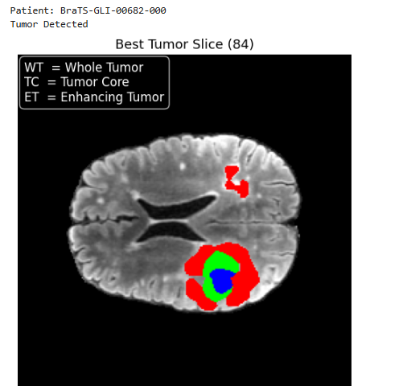

# Brain Tumor Segmentation using TransUNet

## Overview

Brain tumor segmentation is a critical task in medical image analysis, enabling accurate diagnosis, treatment planning, and patient monitoring. This project presents a deep learning-based solution using the TransUNet architecture, which combines Convolutional Neural Networks (CNNs) with Vision Transformers to capture both local spatial features and global contextual dependencies in MRI scans.

Unlike conventional approaches, this system not only focuses on model performance but also provides a practical deployment through a Flask-based web application, allowing real-time interaction and visualization of segmentation results.

This project demonstrates how advanced deep learning models can be applied to real-world healthcare challenges and can assist medical professionals in early tumor detection and treatment planning.

*Note:* The complete pipeline including model inference, Flask integration, and ngrok deployment is implemented within the Jupyter Notebook.

---

## Key Highlights

* Implementation of advanced hybrid architecture (TransUNet)  
* Comparative analysis with UNet baseline  
* Achieved Dice Score of **0.75** on medical dataset  
* End-to-end pipeline: preprocessing → training → prediction → deployment  
* Flask-based web application with real-time inference  
* Deployment testing using ngrok for external accessibility  

---

## Dataset

* BraTS 2023 Dataset  
* Multi-modal MRI scans:
  * T1  
  * T1c  
  * T2  
  * FLAIR  

---

## Methodology

### Data Preprocessing

* MRI normalization  
* Resizing and standardization  
* Multi-modal data handling  

### Model Implementation

* **UNet**
  * Baseline convolutional architecture for segmentation  

* **TransUNet**
  * Hybrid CNN + Transformer architecture  
  * CNN extracts spatial features  
  * Transformer captures long-range dependencies  

### Evaluation Metric

* Dice Similarity Coefficient (DSC) used for segmentation accuracy  

---

## Model Performance

| Model      | Dice Score |
|-----------|----------|
| UNet      | ~0.65 (baseline) |
| TransUNet | **0.75** |

TransUNet outperforms the baseline model due to its ability to capture global context, which is essential for precise tumor boundary detection.

---

## Sample Output




---

## System Workflow

1. User uploads MRI scan  
2. Image is preprocessed  
3. TransUNet model performs segmentation  
4. Tumor region is predicted  
5. Output is visualized through web interface  

---

## Web Application (Deployment)

A Flask-based web application was developed to provide an interactive interface for users.

### Features

* Upload MRI scans  
* Perform tumor segmentation  
* Visualize predicted tumor regions  
* Simple and user-friendly interface  

The application was tested using ngrok, enabling remote access and simulating real-world deployment scenarios.

---

## Project Structure
* ├── notebook.ipynb # Model training and evaluation
* ├── sample_results/ # Sample outputs
* ├── models/ # Model download instructions
* ├── requirements.txt # Dependencies


## Pretrained Models

Due to GitHub file size limitations, trained model weights are not included.

Download from:
https://drive.google.com/drive/folders/1NGUaJes5SfEilNXqjMjAB7kTMyB5MkgC

## Technologies Used
* Python
* PyTorch
* NumPy
* Pandas
* Matplotlib
* Nibabel
* Flask
## Future Improvements
* Improve Dice Score through hyperparameter tuning
* Extend to 3D medical image segmentation
* Deploy on cloud platforms (AWS / GCP)
* Optimize model for real-time clinical usage

## Impact

This project highlights the potential of deep learning in assisting medical professionals with faster and more accurate tumor detection. By integrating advanced AI models with accessible web applications, it bridges the gap between research and real-world healthcare solutions.
## Author

Bilal Ahmed

Bachelor of Science in Software Engineering

## Interests:

Artificial Intelligence, Medical Imaging, Deep Learning

## Installation

```bash
pip install -r requirements.txt

## Usage

### Run Jupyter Notebook

```bash
jupyter notebook notebook.ipynb

### The deployment pipeline is integrated within the Jupyter Notebook using Flask and ngrok, enabling quick testing without a standalone backend script.
